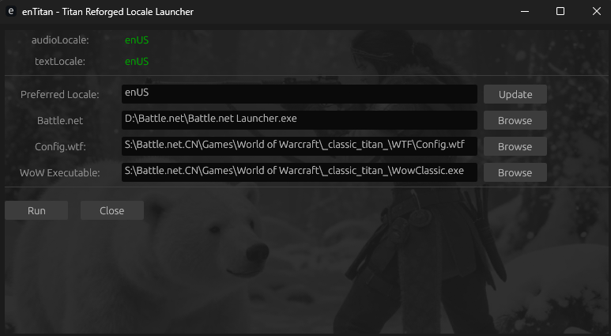

# enTitan — A utility to launch World of Warcaft Titan Reforged with custom locale (enUS)

## Disclaimer

This utility is unsupported.  It is for personal use only.  If you can use it, please feel free.  But there is no support or ongoing maintenance for it.

## Configuration

- Launch the application
- Set the desired locale (enUS for English). Press update.
- Set the path to your Battle.net launcher.
- Set the path to your World of Warcraft Titan Reforged *Config.wtf* file in the WTF folder.
- Set the path to your World of Warcraft binary (not launcher)

## Running

Pressing "Run" will

- Launch Battle.net 
- Wait 10 seconds

- Launch World of Warcraft Titan Reforged directly (should come up in the correct locale) - do not login!
- Wait 60 seconds

- Launch Battle.net again to bring it to the foreground
  - You now press "Play" to launch the game properly (hopefully in English)
  - You can now manually close the original World of Warcraft

## Screenshot

  

## License

See LICENSE file for details.

## AI Disclosure

This utility was developed using agentic AI in Visual Studio Code with Raptor Mini (Preview).  

## Credits

<a href="https://www.flaticon.com/free-icons/document" title="document icons">Document icons created by Arkinasi - Flaticon</a>
